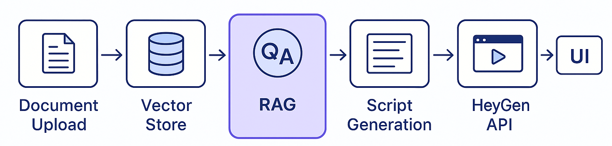
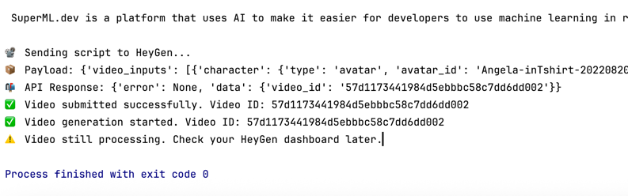

# 🎥 rag-text-speech — Create AI Videos with RAG using HeyGen

**Generate AI explainer videos from documents or queries using Retrieval-Augmented Generation (RAG) and HeyGen API.**


---

## 🔍 Overview

This project demonstrates how to:

- Use **RAG** (Retrieval-Augmented Generation) to extract meaningful information from documents
- Generate video scripts using **OpenAI GPT / Mistral**
- Convert scripts into professional videos using **HeyGen’s API**

---

## 🚀 Features

- 📄 Upload or point to documents
- 🧠 RAG retrieves context using vector search
- ✍️ LLM generates a human-like narration script
- 🗣️ Script is turned into a talking-head avatar video using HeyGen
- 🎬 Instant video link or download

---

## 🏗️ Architecture

1. **Document Indexing (FAISS / Chroma / Qdrant)**
2. **RAG Chain (LangChain or custom logic)**
3. **Script Generation via OpenAI or Mistral**
4. **HeyGen API for video rendering**
5. **Frontend: Streamlit or Gradio**

---

## 🧑‍💻 Setup

```bash
git clone https://github.com/supermldev/rag-text-speech.git
cd rag-text-speech
pip install -r requirements.txt
```

Create a .env file:

OPENAI_API_KEY=your-openai-key
HEYGEN_API_KEY=your-heygen-key

## ▶️ Run the App
python app.py

## 📦 Folder Structure

```
heygenai/
├── rag_pipeline/
│   ├── retriever.py         # Vector DB + similarity search
│   ├── generator.py         # Script generation using LLM
│   └── heygen_video.py      # HeyGen API call
├── app.py                   # Streamlit or Gradio UI
├── examples/                # Sample docs and outputs
├── docs/                    # Architecture diagram, screenshots
├── requirements.txt
└── .env
```

## Success
If everything is fine than you should see:


File gerenated:
https://app.heygen.com/embeds/22a189825fb04a1a8d72d9a92a2f1f64

## 📹 Example Use Cases
	•	🎓 Educational Explainers
	•	🏢 Internal Corporate Training
	•	📢 Marketing Demos
	•	🧾 Document Summaries into Video

## 📄 License

MIT License — free to use and modify with credit.

> ##  ✨ Powered by SuperML.dev
